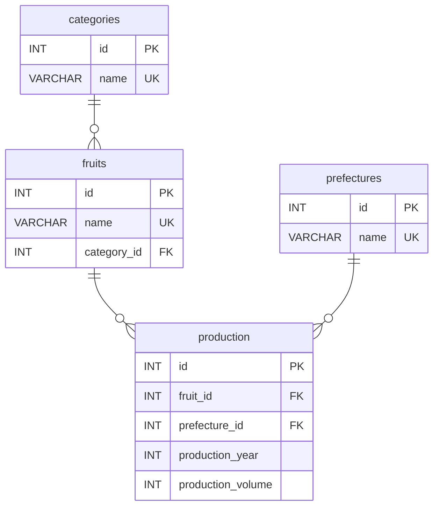

# Fruit Production Database

## 概要

MySQLの学習を目的として作成した、果物の生産量を管理・分析するデータベースです。

2023年から2025年までの果物別・都道府県別の生産量データを登録し、JOIN、集計、副問い合わせ、CASE式、CTE、ウィンドウ関数などを使用してデータの検索・分析を行います。

## 使用技術

- MySQL Ver 9.7.2

## データベース構成

以下の4テーブルで構成しています。

### categories

果物のカテゴリーを管理します。

- id
- name

### fruits

果物の情報を管理します。

- id
- name
- category_id

### prefectures

都道府県を管理します。

- id
- name

### production

果物・都道府県・年度ごとの生産量を管理します。

- id
- fruit_id
- prefecture_id
- production_year
- production_volume

`fruit_id`、`prefecture_id` には外部キー制約を設定しています。

また、同じ果物・都道府県・年度の組み合わせが重複しないよう、UNIQUE制約を設定しています。

## 使用データ

以下の果物について、2023年から2025年までの生産量データを登録しています。

- もも
- すもも
- りんご
- なし
- みかん

生産量の単位はトン（t）です。

## ディレクトリ構成

```text
sql/
├── 01_create_database.sql
├── 02_create_tables.sql
├── 03_insert_data.sql
└── queries/
    ├── 01_basic.sql
    ├── 02_aggregation.sql
    ├── 03_subquery_case.sql
    ├── 04_cte.sql
    └── 05_window_functions.sql
```

### 01_create_database.sql

データベースを作成します。

### 02_create_tables.sql

categories、fruits、prefectures、production の各テーブルを作成し、主キー・外部キー・UNIQUE制約・CHECK制約を設定します。

### 03_insert_data.sql

分析に使用するサンプルデータを登録します。

### queries

データ検索・分析用のSQLを格納しています。

## 実装したSQL

### 基本検索

`01_basic.sql`

- 2025年の果物名、都道府県名、生産量を取得
- JOIN
- WHERE
- ORDER BY

### 集計処理

`02_aggregation.sql`

- 果物ごとの2025年総生産量
- カテゴリーごとの2025年総生産量
- GROUP BY
- SUM()

### 副問い合わせ・CASE式

`03_subquery_case.sql`

- 全生産データの平均生産量を上回るデータの取得
- 生産量を「大・中・小」の3段階に分類
- 副問い合わせ
- AVG()
- CASE

### CTE

`04_cte.sql`

- 2023年から2025年までの果物別総生産量
- WITH
- CTE
- GROUP BY
- SUM()

### ウィンドウ関数

`05_window_functions.sql`

- 果物ごとの生産量1位
- 果物ごとの都道府県別生産量ランキング
- 前年との生産量差
- 2025年に最も生産量が増加したデータ
- ROW_NUMBER()
- LAG()
- PARTITION BY
- CTE

## 実行方法

以下の順番でSQLファイルを実行します。

```text
01_create_database.sql
↓
02_create_tables.sql
↓
03_insert_data.sql
```

MySQLクライアントから実行する場合の例です。

```sql
source C:/path/to/sql/01_create_database.sql
source C:/path/to/sql/02_create_tables.sql
source C:/path/to/sql/03_insert_data.sql
```

データベース作成後、`queries` 配下のSQLを実行することで各種検索・分析結果を確認できます。

例：

```sql
source C:/path/to/sql/queries/01_basic.sql
```

## 学習内容

このデータベースの作成を通して、以下の内容を実践しました。

- PRIMARY KEY、FOREIGN KEY、UNIQUE、CHECKを使用した制約設定
- 複数テーブルのJOIN
- GROUP BYと集計関数を使用したデータ集計
- 副問い合わせを使用した条件検索
- CASE式を使用したデータ分類
- CTEを使用した処理の分割
- ROW_NUMBER()を使用したランキング
- LAG()を使用した前年データとの比較
- ウィンドウ関数とCTEを組み合わせたデータ分析

## データ出典

生産量データは、農林水産省「作物統計調査・果樹生産出荷統計」の公表データを参考にしています。

2025年の一部データについては、公表時点の概数値を使用しています。


※ production テーブルでは、fruit_id・prefecture_id・production_year の組み合わせに UNIQUE 制約を設定しています。
